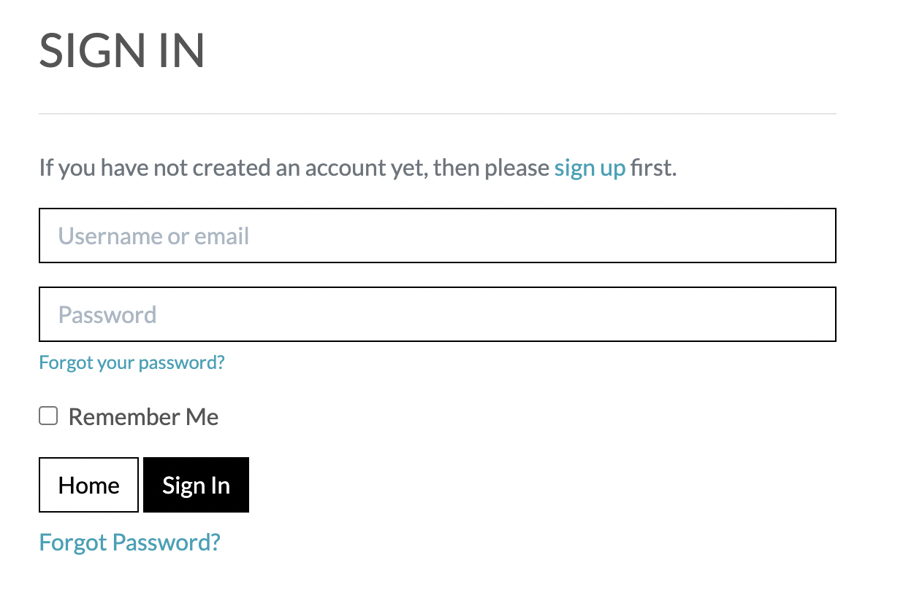
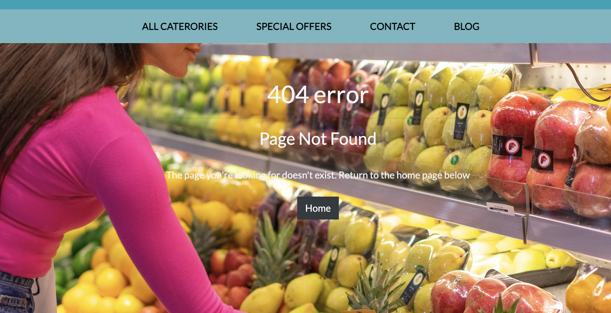

# Grocery Store

At Grocery Store, we are more than just a place to shop for groceries; we are your community's one-stop destination for quality, convenience, and a delightful shopping experience. As your trusted neighborhood grocer, we take pride in providing an extensive selection of fresh, local, and globally sourced products to meet your every need.

The payment system uses Stripe. Please note that this website is for educational purposes do not enter any personal credit/debit card details when using the site.

To test this system, test card details can be used. A list of these can be found in Stripe's documentation [here](https://stripe.com/docs/testing#cards).

The live link can be found here - [Grocery Store](https://groceryapp-856a47122c58.herokuapp.com/)
- The GitHub link can be found here - [Grocery Store](https://github.com/mehatabpathan/PP5.git)


- [User Experience (UX)](#user-experience--ux-)
  * [User Stories](#user-stories)
  * [Design](#design)
    + [Colour Scheme](#colour-scheme)
    + [Imagery](#imagery)
    + [Fonts](#fonts)
    + [Wireframes](#wireframes)
- [Agile Methodology](#agile-methodology)
- [Database Schema](#database-schema)
- [Security Features and Defensive Design](#security-features-and-defensive-design)
  * [User Authentication](#user-authentication)
  * [Form Validation](#form-validation)
  * [Database Security](#database-security)
  * [Custom error pages:](#custom-error-pages-)
- [Features](#features)
  * [Header](#header)
  * [Footer](#footer)
  * [Home Page](#home-page)
  * [User Account Pages](#user-account-pages)
  * [Profile](#profile)
  * [Home Decor (Products)](#home-decor--products-)
  * [Product Detail](#product-detail)
  * [Home Decor Management](#home-decor-management)
  * [Bag](#bag)
  * [Checkout](#checkout)
  * [Interior Design Services](#interior-design-services)
  * [Design Services Management](#design-services-management)
  * [Interior Design Projects](#interior-design-projects)
  * [Previous Projects Management](#previous-projects-management)
  * [Testimonials](#testimonials)
  * [Contact Form](#contact-form)
  * [Enquiries Dashboard](#enquiries-dashboard)
  * [Error Pages](#error-pages)
- [Business Model](#business-model)
- [Marketing Strategy](#marketing-strategy)
  * [SEO](#seo)
  * [Content marketing](#content-marketing)
  * [Social Media Marketing](#social-media-marketing)
  * [Email Marketing](#email-marketing)
- [Testing](#testing)
- [Deployment - Heroku](#deployment---heroku)
- [AWS Set Up](#aws-set-up)
- [Forking this repository](#forking-this-repository)
- [Cloning this repository](#cloning-this-repository)
- [Languages](#languages)
- [Frameworks - Libraries - Programs Used](#frameworks---libraries---programs-used)
- [Credits](#credits)
- [Acknowledgments](#acknowledgments)

<small><i><a href='http://ecotrust-canada.github.io/markdown-toc/'>Table of contents generated with markdown-toc</a></i></small>


## User Experience (UX)

A positive grocery store user experience involves a well-organized layout, friendly staff, and efficient checkout, while factors like cleanliness, product availability, and technology integration further contribute to customer satisfaction and loyalty.

### User Stories

#### EPIC | Viewing and Navigation
- As a Site User, I can intuitively navigate around the grocery store website so that I can find content.
- As a Site User, I can view a list of products available in the grocery store so that I can select a product to view.
- As a shopper, I can click on a product in the grocery store so that I can read the full product details.
- As a shopper, I can view a specific category of grocery products so I can browse the type of products I'm looking for.
- As a shopper, I can search all grocery products so that I can find what I am looking for.
- As a shopper, I can sort all grocery products so that I can view products based on price or title.
- As a site user, I can view a list of Grocery Store Services provided so I can understand what each service entails and make an enquiry if desired.
- As a site user, I can read feedback left by other customers so I see what feedback they gave on the Grocery Store Services they received.
- As a site user, I can view pictures of previous grocery store displays and arrangements so that I can see if I like the layout and build trust in the store.

#### EPIC | User Account and Profile
- As a site user, I can register an account so that I can have a personal account.
- As a site user, I can log in or log out of my account so that I can keep my account secure.
- As a site user, I can see my login status so that I know if I'm logged in or out.
- As a site user, I can save my personal details in my user profile so that I do not have to fill them out for future orders.
- As a site user, I can view my order history so that I can remember what purchases I've made.
- As a site user, I can recover my password in case I forget it so that I can recover access to my account.

#### EPIC | Purchasing
- As a shopper, I can add a number of products in different quantities to my shopping bag so that I can purchase them all together when I am ready.
- As a shopper, I can view a running total of my shopping bag as I am shopping so that I can see how much it costs in total.
- As a shopper, I can view the contents of my shopping bag at any time so I can see what is included and the total cost.
- As a shopper, I can adjust the quantity of individual products in my bag so that I can easily make changes before I purchase.
- As a shopper, I can see a summary of my shopping cart when I checkout so that I know what products are included and the total cost before I commit to purchasing.
- As a shopper, I can easily enter my payment information securely so that I can purchase my chosen products quickly with no issues.
- As a shopper checkout as a guest so I don't have to sign up for an account.
- As a shopper, I can view an order confirmation after checkout so that I know my purchase was successful.
- As a shopper, I can receive an email confirmation of my order so that I have a record of my purchase.


#### EPIC | Admin & Store Management
- As a store owner, I can add/edit/delete products through an easy-to-use interface so that I can manage the store's contents.
- As a site owner, I can add/edit/delete all categories provided through an easy-to-use interface so that I can manage the site's contents.
- As a site owner, I can add/delete images and location of previous  projects so that I can manage the site's contents.
- As a site owner, I can view and delete customer enquiries on the front-end without having to access the admin panel.

#### EPIC | User Interaction
- As a site user, I can submit an contact form so that I can contact about a groceries.
- As a site user, I can add / edit / delete a  in relation to a consultation I received so that I can give my feedback.
- As a site user, I can sign up for the website's newsletter so that I can keep up to date with new products and promotions.


### Design

The site has a elegant and clean design with the use of gold detail to give the idea of luxury and opulence. 

#### Colour Scheme
Colour palette from Coolors


The colour scheme of the site predominantly uses a combination of black, white, and shades of blue. Backgrounds utilize dynamic images with fallback colors, buttons have gradient effects from dark to light blue, and text colors vary from black to white. Specific classes define link and badge colors, and media queries adapt styles for responsiveness. Overall, the scheme achieves a modern and visually appealing design through a careful use of contrast and gradients.

#### Imagery
There is only one main static image on the site which is of homepage in the store. The colour scheme of the site ties in with this main homepage image which largely consists of all the colors. The rest of the imagery will be uploaded by the site owner for individual products, services. 

#### Fonts
The 'lato font is the main font used for the body of the website. This font was imported via Google Fonts. the 'Lato' font is set as the primary typeface for the text content on the webpage.

#### Wireframes

<details>

 <summary>Home Page</summary>


</details>

<details>

 <summary>All Categories</summary>


</details>

<details>

 <summary>Contact</summary>


</details>

<details>

 <summary>Blog</summary>


</details>

<details>

 <summary>Bag</summary>


</details>

<details>

 <summary>Checkout</summary>


</details>

<details>

 <summary>Order Confirmation</summary>


</details>

<details>

 <summary>Profile</summary>


</details>


## Agile Methodology
Github projects was used to manage the development process using an agile approach. Please see link to project board [here](https://github.com/users/mehatabpathan/projects/7)


The 5 Epics listed above were documented within the Github project as Milestones. A Github Issue was created for each User Story which was then allocated to a milestone(Epic). Each User Story has defined acceptance criteria to make it clear when the User Story has been completed. The acceptance criteria are further broken down into tasks to facilitate the User Story's execution.

## Database Schema 

Two relational databases were used to create this site - during production SQLite was used and then Postgres was used for the deployed Heroku version. Below is an image of how the database models relate to each other:


## Security Features and Defensive Design
### User Authentication

Where I have used Django's Class-based-views; Django's LoginRequiredMixin is used to make sure that any requests to access secure pages by non-authenticated users are redirected to the login page. Django's UserPassesTestMixin is used to limit access based on certain permissions i.e. to ensure users can only edit/delete  for which they are the author or if the user is the superuser. If the user doesn't pass the test they are shown an HTTP 403 Forbidden error.

Where I have used function based views I have used Django's login_required and user_passes_test decorators to restrict access as required. 

### Form Validation
If incorrect or empty data is added to a form, the form won't submit and a warning will appear to the user informing them what field raised the error.

### Database Security
The database url and secret key are stored in the env.py file to prevent unwanted connections to the database. Stripe keys and wh secret are also stored in the env.py file. 

Cross-Site Request Forgery (CSRF) tokens were used on all forms throughout this site.

### Custom error pages:
Custom Error Pages were created to give the user more information on the error and to provide them with buttons to guide them back to the site.

400 Bad Request - Grocery Store is unable to handle this request.
403 Page Forbidden - Looks like you're trying to access forbidden content. Please log out and sign in to the correct account.
404 Page Not Found - The page you're looking for doesn't exist.
500 Server Error - Due to an internal error we are unable to process this request.

## Features

### Header


**Logo**
- A customised logo was created using Hatchful by Shopify which is a free logo generator.
- This logo is positioned in the top left of the navigation bar. The logo is linked to the home page for ease of navigation for the user.

**Navigation Bar**

- The navigation bar is visible at the top of every page and includes links to the other pages.

**Search Bar**


- The search bar displays above the nav bar.
- On smaller screens, this bar becomes a search icon which when clicked will drop down the full bar.
- Any searched word will match itself to any text in the product's title, or description and display the results on the product's page.


**User Icon**

- The User icon navigation link is a drop down menu which includes the Sign up and Log in links. 
- Once a user has signed in, their username will display beside the user icon.
- The options to Sign up or Log in will change to the option to log out once a user has logged in.
- Once a user has signed in, the 'My Profile' option becomes available in the User dropdown.


- If the superuser has signed in, more options such as 'Home Decor Management', 'Design Service Management', 'Previous Project Management' and 'Enquiries' become available in the User dropdown.


- The navigation bar is fully responsive, collapsing into a hamburger menu when the screen size becomes too small.
- Hovering over the links will turn the font gold.

**Bag Icon**


- Located on the right side of the navbar next to the User icon is the bag Icon.
- Once a product is added to the bag, a number displaying the total quantity of items appears, located at the top right of the bag icon.
- As the user adds products to their bag, a toast message appears in the top right-hand corner of the screen informing the user that the item has been added, giving them a snapshot of the bag contents and the total cost of the bag.


- Clicking the bag icon navigates the user to the shopping bag page which displays a summary of what's been added.

### Footer


- The footer appears at the bottom of every page.
- Social media icons (Facebook, Instagram, Twitter) are included with links to respective profiles.
- There is a newsletter signup section powered by Mailchimp where the user can input their email address to signup to the monthly newsletter.
- Clicking all external links will open up the respective website in another tab to avoid pulling the user away from the site.

### Home Page

**Call to Action Section**


- The home page includes a call to action section which encourages the user to 'shop now' in the background image id added.

### User Account Pages

**Sign Up**


**Sign In**



**Log Out**


- Django allauth was installed and used to create the Sign up, Log in and Log out functionality. 
- Success messages inform the user if they have logged in/ logged out successfully.
- When a user signs up for an account they must verify their email address by clicking on the authentication link emailed  to the address they provided.
- If a user forgets their password they can reset it by clicking the 'Forgot Password' on the log in page.


### Profile
**Delivery Details**


- The delivery details section stores the user's delivery address and phone number.
- The information provided here is used to autofill the delivery address when placing an order.

### Products page


- When clicking the 'Home Decor' link in the navbar the dropdown menu will show all the different categories including 'Sofas', 'Tables', 'Chairs', 'Lighting' and 'Textiles'. 


- The 'All' link will display a list of all products from the database.
- Clicking any of the categories will filter the products to only show products from the category selected.
- The products selected will display as the page heading.


- Each product card shows an image of the product, its title, excerpt and price.
- If the user is a superuser, edit and delete buttons will appear at the bottom of the product card.
- The products page is fully responsive, adjusting how many products are on each row depending on the user's screen size.
- A sort box is located on the products page where users can sort all products by price in ascending or descending order and by title (A-Z).


### Product Detail


- When the user clicks on an individual product card they are taken to the full product details. The link is a bootstrap stretched link so clicking anywhere on the card will work.
- The product detail page displays the product image, title, price, product details.
- If the user is a superuser, edit and delete buttons will appear below these details.

**Quantity Buttons**
- The quantity buttons are located underneath the product details and are used to add items to the bag.
- The plus and minus buttons increase and decrease the input value.
- If the value is set to 1 the minus quantity will be disabled. Respectively if the value is set to 99 the plus button is disabled.
- If the user manually types in a negative number or a number >99 and clicks "Add to Bag" an error button will appear informing the user of the parameters needed to be successful.
- Clicking the 'Add to Bag' button takes the number in the input field and adds that amount of products to the bag.
- Clicking the 'Keep Shopping' button takes the user back to the store.

### Home Decor Management
**Add Product**


- The add product page can be accessed by clicking the 'Product management' button on the MyAccounts. These options are only visible to superusers.
- If a user tries to add a product (by changing the url) without being a superuser they are redirected to a custom 403 page.
- The user must fill out all the fields that have an Asterix. If the form is submitted with any of these fields left blank or with just whitespace then an error message will appear above that particular field, notifying the user of the issue.
- The SKU field must be unique. An error message will appear if the SKU already exists.
- If a price is added with more than 6 digits the form will fail and an error message will appear under the price field.
- The user can upload a photo if they wish. If they choose not to, a default image displays as their product image.
- Clicking the 'Add Product' button at the bottom of the form will create the product providing there are no errors on the form.
-  The user will receive a success message notifying them that the product has been successfully added.

**Edit Product**


- The superuser can choose to edit a Product by clicking the edit button on the product card or on the product Management page. 
- The form opens with all fields populated with the original content.
- The image field displays a thumbnail of the existing image and has a checkbox option to remove it. Checking this will change the image to the default image.
- If a user tries to add a product (by changing the url) without being a superuser they are redirected to a custom 403 page.
- The superuser will receive a success message notifying them that the product has been successfully updated.

**Delete Product**

- The superuser can choose to delete a Product by clicking the delete button on the product card or on the product detail page. 
- The superuser is asked to confirm if they wish to delete the product or cancel.
- The superuser will receive a success message notifying them that the product has been successfully deleted.

### Bag


- When the user clicks on the shopping bag icon in the nav bar they are taken to the shopping bag page which shows the products which the user has added to their cart, unit price, quantity and subtotal.

**Quantity Buttons**
- The quantity input box displays the product quantity the user has added to their bag.
- The plus and minus buttons increase and decrease the input value.
- If the value is set to 1 the minus quantity will be disabled. Respectively if the value is set to 99 the plus button is disabled.

**Update and Delete Buttons**


- Clicking the 'update' icon button saves any changes to the quantity and updates the item's subtotal.
- Clicking the 'Bin' icon button removes the item completely from the user's bag.
- If the user manually types in a negative number and clicks 'update', the item will be removed from the item from the bag.
- If the user manually types in a number >99 and clicks 'update' an error message will display informing the user of the correct parameters.

### Checkout 


**Details**
- Within the details section the user can fill out their contact details, delivery address, and card number.
- If the user is a guest, a link to create an account or login will be present.
- If the user is signed in a checkbox to save the delivery information can be checked.
- If the user is signed in and has delivery information saved, the delivery details and email address will be automatically filled in.
- If a user leaves a required field empty, inputs whitespace in a required field or includes text in the phone number field an error message will prompt the user to 'Fill in the field' or 'match the format requested'

**Order Summary**

- The order summary section details all the items about to be purchased, along with the quantity, subtotal and a grand total.
- Next to the order summary title will be a number reflecting the total number of items that appear in the order.
- Clicking the product image in the summary will take the user to that product's detail page.

**Payment**

- The card payment is handled by Stripe to ensure secure payment.
- Incorrect card numbers will automatically show an invalid card number error.
- A loading screen will appear when a payment is being processed to stop the user clicking away.
- There is a warning message at the bottom of the page informing the user of how much their card is about to be charged.
- If the payment form doesn't submit properly or the user closes the browser during the wait animation, the order will still be created in the database through the webhook. 
- Once the payment is processed, the webhook will search the database to confirm the order exists. If it cannot find it, it will create one using the payment information.

**Confirmation**


- Once the order has been processed the user is taken to the checkout success page.
This page summarises the completed order.
- An email will be sent to the user with their order confirmation
- At the end of the summary is a 'Keep Shopping' button that takes the user back to the Home page.


### Contact Form


- A user can open up the contact form by clicking on the "Enquire Now" button on the Interior Design Services page or by clicking the 'Contact' button in the Nav bar.
- If the user is logged in, the email field is prepopulated with the user's email address. 
- The form contains a drop down menu where the user can select the type of enquiry from a list so that the site owner knows what the enquiry is about.
- The user must fill out all the fields that have an Asterix. If the form is submitted with any of these fields left blank or with just whitespace then an error message will appear above that particular field, notifying the user of the issue.
- When the form is submitted, the user receives an email confirmation of their enquiry so that they have a record of it.

### Blog


- Blog Post is written by admin


### Error Pages
Custom Error Pages were created to give the user more information on the error and to guide them back to the site.




- 400 Bad Request - Fresh Nest is unable to handle this request.
- 403 Page Forbidden - Looks like you're trying to access forbidden content. Please log out and sign in to the correct account.
- 404 Page Not Found - The page you're looking for doesn't exist.
- 500 Server Error - Due to an internal error we are unable to process this request.


### Social Media Marketing 
For this site, a Facebook business page has been created for organic social media marketing. The Facebook page includes a 'Shop Now' button which takes the user to the Fresh Nest website. The page pairs well with the content media marketing on the main site as images of previous projects and new product arrivals can be shared easily.


### Email Marketing
Visitors to the site can sign up to the newsletter and do not need to have an account to do so. A signup box is included in the footer of the site. This allows the business to share news with customers and potential customers including new products/services and special offers. Mailchimp was used to create this service. 

## Testing
Testing and results can be found [here](./TESTING.md).

## Deployment - Heroku

To deploy this page to Heroku from its GitHub repository, the following steps were taken:

### Create the Heroku App:
- Log in to [Heroku](https://dashboard.heroku.com/apps) or create an account.
- On the main page click the button labelled New in the top right corner and from the drop-down menu select "Create New App".
- Enter a unique and meaningful app name.
- Next, select your region.
- Click on the Create App button.

### Attach the Postgres database:
- In the Resources tab, under add-ons, type in Postgres and select the Heroku Postgres option.
- Copy the DATABASE_URL located in Config Vars in the Settings Tab.
- Go back to your IDE and install 2 more requirements:
    - `pip3 install dj_databse_url`
    - `pip3 install psycopg2-binary` 
- Create requirements.txt file by typing `pip3 freeze --local > requirements.txt`
- Add the DATABASE_URL value and your chosen SECRET_KEY value to the env.py file. 
- In settings.py file import dj_database_url, comment out the default configurations within database settings and add the following: 

```
DATABASES = {
    'default': dj_database_url.parse(os.environ.get('DATABASE_URL'))
}
```
- Run migrations and create a superuser for the new database. 
- Create an if statement in settings.py to run the postgres database when using the app on heroku or sqlite if not

```
    if 'DATABASE_URL' in os.environ:
        DATABASES = {
            'default': dj_database_url.parse(os.environ.get('DATABASE_URL'))
        }
    else:
        DATABASES = {
            'default': {
                'ENGINE': 'django.db.backends.sqlite3',
                'NAME': BASE_DIR / 'db.sqlite3',
            }
    }
```

- Create requirements.txt file by typing `pip3 freeze --local > requirements.txt`
- Create a file named "Procfile" in the main directory and add the following: `web: gunicorn project-name.wsgi:application`
- Add Heroku to the ALLOWED_HOSTS list in settings.py in the format ['app_name.heroku.com', 'localhost']

- Push these changes to Github.

### Update Heroku Config Vars
Add the following Config Vars in Heroku:

|     Variable name     |                           Value/where to find value                           |
|:---------------------:|:-----------------------------------------------------------------------------:|
| CLOUDINARY_URL        | Created cloudinary Dashboard                                               |
| DATABASE_URL          | Postgres generated (as per step above)                                        |
| EMAIL_HOST_PASS       | Password from email client                                                    |
| EMAIL_HOST_USER       | Site's email address                                                          |
| SECRET_KEY            | Random key generated as above                                                 |
| STRIPE_PUBLIC_KEY     | Stripe Dashboard > Developers tab > API Keys > Publishable key                |
| STRIPE_SECRET_KEY     | Stripe Dashboard > Developers tab > API Keys > Secret key                     |
| STRIPE_WH_SECRET      | Stripe Dashboard > Developers tab > Webhooks > site endpoint > Signing secret |

### Deploy
- NB: Ensure in Django settings, DEBUG is False
- Go to the deploy tab on Heroku and connect to GitHub, then to the required repository. 
- Scroll to the bottom of the deploy page and either click Enable Automatic Deploys for automatic deploys or Deploy Branch to deploy manually. Manually deployed branches will need re-deploying each time the repo is updated.
- Click View to view the deployed site.

The site is now live and operational.


## Forking this repository
- Locate the repository at this link [Fresh Nest](https://github.com/mehatabpathan/PP5).
- At the top of the repository, on the right side of the page, select "Fork" from the buttons available. 
- A copy of the repository is now created.

## Cloning this repository
To clone this repository follow the below steps: 

1. Locate the repository at this link [Fresh Nest](https://github.com/mehatabpathan/PP5). 
2. Under **'Code'**, see the different cloning options, HTTPS, SSH, and GitHub CLI. Click the prefered cloning option, and then copy the link provided. 
3. Open **Terminal**.
4. In Terminal, change the current working directory to the desired location of the cloned directory.
5. Type **'git clone'**, and then paste the URL copied from GitHub earlier. 
6. Type **'Enter'** to create the local clone. 

## Languages

- Python
- HTML5
- CSS3
- Javascript

## Frameworks - Libraries - Programs Used
- [Django](https://www.djangoproject.com/): Main python framework used in the development of this project
- [Django-allauth](https://django-allauth.readthedocs.io/en/latest/installation.html): authentication library used to create the user accounts
- [JQuery](https://jquery.com/)
- [PostgreSQL](https://www.postgresql.org/) was used as the database for this project.
- [SQLite](https://www.sqlite.org/index.html) - was used as the database during production.
- [Stripe](https://stripe.com/ie) used for the payments system.
- [Heroku](https://dashboard.heroku.com/login) - was used as the cloud based platform to deploy the site on.
- [Responsinator](http://www.responsinator.com/) - Used to verify responsiveness of website on different devices.
- [Balsamiq](https://balsamiq.com/) - Used to generate Wireframe images.
- [Chrome Dev Tools](https://developer.chrome.com/docs/devtools/) - Used for overall development and tweaking, including testing responsiveness and performance.
- [Font Awesome](https://fontawesome.com/) - Used for icons in information bar.
- [GitHub](https://github.com/) - Used for version control and agile tool.
- [Google Fonts](https://fonts.google.com/) - Used to import and alter fonts on the page.
- [W3C](https://www.w3.org/) - Used for HTML & CSS Validation.
- [Jshint](https://jshint.com/) - used to validate javascript
- [Coolors](https://coolors.co/) - Used to create colour palette.
- [Favicon](https://favicon.io/) - Used to create the favicon.
- [Lucidchart](https://lucid.app/documents#/dashboard) - used to create the database schema design
- [Grammerly](https://app.grammarly.com/) - used to proof read the README.md
- [Techsini](https://techsini.com/multi-mockup/index.php) - Site mockup generator
- [Crispy Forms](https://django-crispy-forms.readthedocs.io/en/latest/) used to manage Django Forms
- [Bootstrap 4.6](https://getbootstrap.com/docs/4.6/getting-started/introduction/): CSS Framework for developing responsiveness and styling
- [Hatchful](https://hatchful.shopify.com/): Used to generate custom logo
- [Tables Generator](https://www.tablesgenerator.com/markdown_tables): Used to convert excel testing tables to markdown
- [Sitemap Generator](www.xml-sitemaps.com): used to create sitemap.xml 
- [Privacy Policy Generator](https://www.privacypolicygenerator.info/): Used to create the site's privacy policy
- [Mailchimp](https://mailchimp.com/?currency=EUR): Used to create the newsletter signup functionality.


## Credits

- [W3Schools](https://www.w3schools.com/)
- [Django Docs](https://docs.djangoproject.com/en/4.0/)
- [Bootstrap 4.6 Docs](https://getbootstrap.com/docs/4.6/getting-started/introduction/)
- [Stack Overflow](https://stackoverflow.com/)
- [Pexels](https://www.pexels.com/): Imagery on the site was sourced from Pexels.com
- [Unsplashed](https://unsplash.com/): Imagery on the site was sourced from Unsplash
- [Code Institute - Boutique Ado Walkthrough Project](https://github.com/Code-Institute-Solutions/boutique_ado_v1)
- [Stack Overflow](https://stackoverflow.com/questions/19619428/html5-form-validation-pattern-alphanumeric-with-spaces): To prevent form being submitted with whitespace


## Acknowledgments

Many thanks to my mentor Antonio for his support and advice. Thanks to The Code Institute slack community for their quick responses and very helpful feedback.